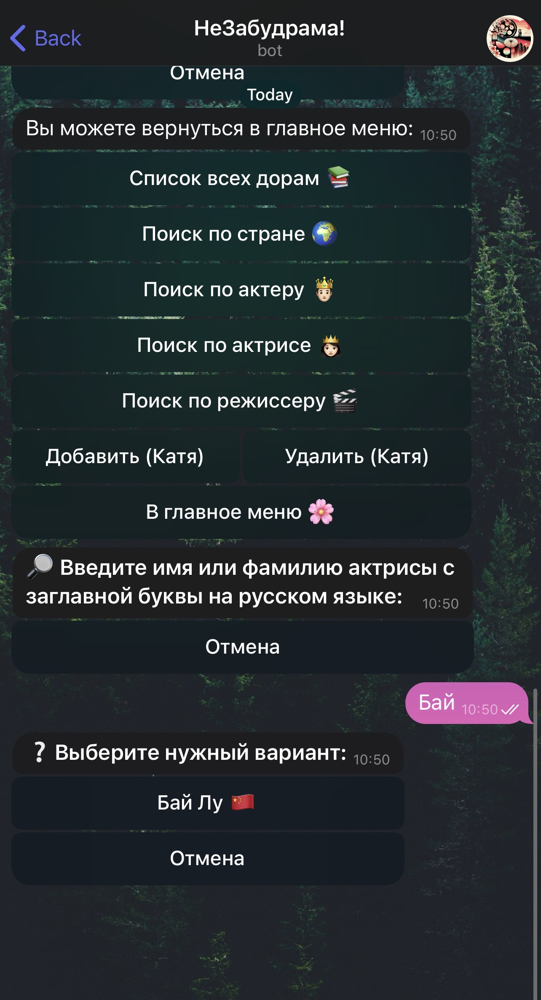

# MyAsianDramaBot 🇰🇷🇨🇳🇯🇵

Telegram bot for Asian drama fans: add dramas, search with filters, paginate results, and rate titles.  

🖥️ The production version runs on a private VPS (24/7 uptime).  
🔒 This repository is portfolio-only: it contains example code, requirements, README, and CI — no secrets or tokens.  
👉 Try the live bot: [t.me/MyAsianDramaBot](https://t.me/MyAsianDramaBot)

---

## Features
- Add dramas through a guided dialog (title, actors, year, rating, poster URL)  
- Search, filters by country, pagination (Markdown v2 safe formatting)  
- Logging and error handling  

## Tech Stack
Python · python-telegram-bot v20 · aiosqlite · asyncio  

---

## Demo

> See [PORTFOLIO_ONLY.md](PORTFOLIO_ONLY.md) for portfolio disclaimer.
